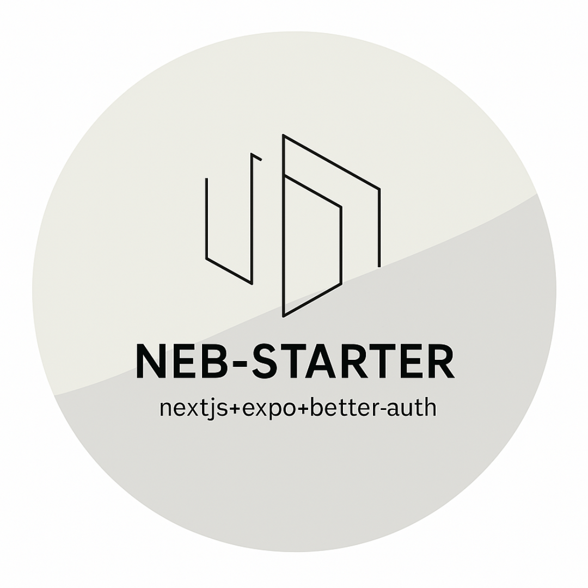

# NEB Starter Kit

<div align="center">
  
  <h1>NEB Starter Kit</h1>
  <p>A production-ready universal app monorepo featuring Next.js, Expo, and better-auth</p>
</div>

## 🚀 Overview

NEB Starter Kit (Next.js + Expo + Better-auth) provides a robust foundation for building cross-platform applications with a shared codebase. This monorepo is structured to help you build and maintain web and mobile applications that share business logic, authentication flows, and database access patterns.

### Universal Authentication System

A key innovation in this starter kit is the **universal authentication system** where the Next.js web app serves as an authentication server for both platforms:

- The web app handles authentication directly through its API routes
- The mobile app connects to the web app's auth endpoints for consistent auth flows
- Single source of truth for user authentication across platforms
- Shared session management and token handling

## ✨ Features

- **Next.js Web App** - Modern web frontend and backend with App Router and server components
- **Expo Mobile App** - Cross-platform mobile experiences using React Native
- **Universal Authentication** - The web app serves as an authentication server for both platforms
- **Role-Based Access Control** - Admin dashboard with authorization via Better-Auth admin plugin
- **Biometric Authentication** - Mobile app includes passkey/biometric auth via [expo-passkey](https://www.npmjs.com/package/expo-passkey)
- **Database Integration** - Type-safe database access with Prisma ORM and Neon PostgreSQL
- **Monorepo Structure** - Organized codebase with shared packages
- **Flexible Deployment** - Deploy to any Node.js-compatible hosting service

## 🛠️ Tech Stack

- **Frontend (Web)**: Next.js, React, TailwindCSS v4, shadcn/ui
- **Frontend (Mobile)**: Expo, React Native, NativeWind
- **Authentication**: Better-Auth
- **Database**: Prisma ORM, PostgreSQL (Neon)
- **Styling**: TailwindCSS, NativeWind
- **Package Management**: Yarn

## 📂 Project Structure

```
neb-starter/
├── apps/
│   ├── mobile/           # Expo mobile application
│   └── web/              # Next.js web application
├── packages/
│   ├── database/         # Shared Prisma schema and database client
│   ├── google-polyauth/  # A plugin that extends Better-Auth's google social provider with multiple client IDs support.
│   └── nebstarter-cache/ # Custom caching solution
```

## 🚀 Getting Started

### Prerequisites

- Node.js 18+ and Yarn
- For mobile development: iOS Simulator/Android Emulator or physical devices

### Installation

```bash
# Clone the repository
git clone https://github.com/iosazee/neb-starter.git my-app

# Navigate to the project directory
cd my-app

# Install dependencies
yarn install

# Set up environment variables
cp apps/web/.env.sample apps/web/.env
cp apps/mobile/.env.sample apps/mobile/.env
cp packages/database/.env.sample packages/database/.env

# Start development servers
yarn dev
```

## 🌐 Running the Web App

```bash
# From the root directory
cd apps/web
yarn dev

# The app will be available at http://localhost:3000
```

## 📱 Running the Mobile App

```bash
# From the root directory
cd apps/mobile
yarn dev

# IMPORTANT: This requires running a development build on your own
# device or simulator and may not work reliably with Expo Go.

# For iOS simulator
yarn ios

# For Android simulator
yarn android

# For development build on physical device
yarn run:ios    # For iOS devices
yarn run:android  # For Android devices
```

## 🗄️ Database Setup

The starter kit uses Prisma ORM with PostgreSQL (Neon), but you can easily configure it to use another ORM and/or database provider of your choice:

1. Update the `DATABASE_URL` in `packages/database/.env`
2. Update the provider in `packages/database/prisma/schema.prisma` if needed
3. Run `yarn prisma db push` to sync your schema

## 🔒 Authentication

The starter kit implements a universal authentication system with better-auth:

- **Web App as Auth Server**: The Next.js app functions as the central auth server for the entire ecosystem
- **Cross-Platform Authentication**: Consistent auth experience across web and mobile
- **Multiple Auth Methods**:
  - Google OAuth for web and mobile
  - GitHub OAuth for web only
  - Apple Sign-In (iOS only)
  - Passkey Authentication via expo-passkey (mobile)

Configuration variables can be found in the respective `.env.sample` files.

## 🚢 Deployment

The web app can be deployed to any platform that runs Node.js:

- Vercel
- Netlify
- AWS
- Cloudflare Pages
- Self-hosted infrastructure

For mobile app deployment, follow standard Expo build and submission processes for App Store and Google Play.

## 🤝 Contributing

Contributions are welcome! Please feel free to submit a Pull Request.

## 📄 License

This project is licensed under the MIT License - see the LICENSE file for details.
